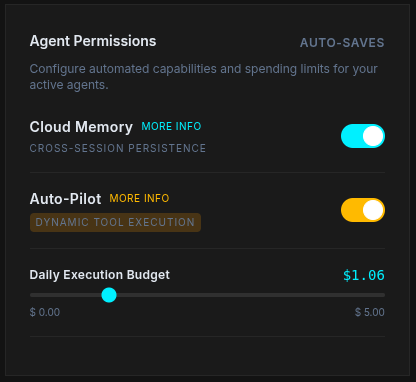

# Auto-Pilot Tool Discovery Example (SmolAgents)

This example demonstrates how to build a fully autonomous agent using Hugging Face's **SmolAgents** that dynamically discovers and executes missing capabilities on the fly via the Neonia MCP Gateway.

## The Problem: Tool Rigidity

Traditionally, AI agents are hard-coded with a static list of tools. If a user asks for something outside that predefined list (like scraping a URL or checking a stock price), the framework lacks the capability. This approach:

1. Forces developers to predict every possible user request.
2. Bloats the system prompt with hundreds of tool schemas.
3. Often leads to the agent hallucinating or failing when an unknown request is encountered.

## The Neonia Solution: Auto-Pilot Discovery

Instead of pre-loading tools, this agent is equipped with only two meta-tools from the Neonia MCP Gateway:

- `neo_sys_tool_discovery`: Searches the global Neonia registry for missing capabilities.
- `neo_sys_tool_execute`: Dynamically executes the discovered tool using its required JSON payload.

When asked to summarize the `neonia.io` webpage, the agent realizes it lacks a web scraping tool. It autonomously searches the Gateway, discovers the `neo_web_url_to_markdown` tool, and executes it perfectly without any human intervention or code changes.

### Impact

- **Infinite Capabilities:** The agent has access to the entire Neonia library on demand.
- **Prompt Optimization:** Only the active tools consume context tokens.
- **True Autonomy:** The agent learns and adapts to user requests in real-time.

## How It Works

1. The agent connects to `mcp.neonia.io/mcp?tools=neo_sys_tool_discovery,neo_sys_tool_execute`.
2. It subclasses `smolagents.Tool` to dynamically expose these MCP meta-tools to the agent.
3. Hugging Face's `CodeAgent` evaluates the task and formulates a plan.
4. When asked to fetch a URL, the agent searches for a tool, finds `neo_web_url_to_markdown`, and immediately executes it.

## Setup

1. Install dependencies using `uv`:

   ```bash
   uv sync
   ```

2. Create a `.env` file with your API keys:

   ```env
   OPENROUTER_API_KEY="your-openrouter-key"
   NEONIA_API_KEY="your-neonia-key"
   ```

3. Enable Auto-Pilot Permissions:
   Before running the agent, you **MUST** enable the **Auto-Pilot (Dynamic Tool Execution)** permission in your Neonia Dashboard. This authorizes the agent to dynamically execute tools it discovers on the fly.

   

4. Run the agent:

   ```bash
   uv run python main.py
   ```
